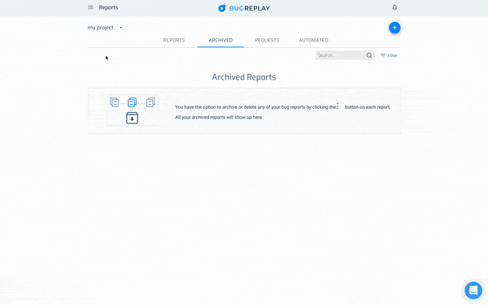

# BugReplay WebDriver.IO Service
The BugReplay WDIO service records screencasts of your automated tests including timesynced JavaScript Console and Network logs
## Installation
Install the package

```sh
npm install wdio-bugreplay-service --save-dev
```

or if you prefer to use [yarn](https://yarnpkg.com/)

```sh
yarn add wdio-bugreplay-service --dev
```

## Configuration

### Getting an API key
You will need to sign up for an account at https://bugreplay.com. After that you will need to login and get an API key by clicking the Hamburger Menu, click My Settings, and then Show API Key. You'll use this in the configuration file.



### Adding the BugReplay Integration
In wdio.conf.js, you will need to add both the bugreplay service as well as add the configure the BugReplay automation extension to be added to chrome:

```js
// wdio.conf.js
export.config = {
    // ...
    capabilities: [{
      // ...
      browserName: 'chrome',
      'goog:chromeOptions': {
        args: [
          '--load-extension=node_modules/bugreplay-automation/extension/',
          '--auto-select-desktop-capture-source=Record This Window'
        ]
      },
    }
    // ...
    services: [
        ['bugreplay', {
            apiKey: 'YOUR_BUGREPLAY_API_KEY_GOES_HERE',
            saveSuccessfulTests: true // the default is false
        }]
    ],
    // ...
};
```

After this configuration your tests will automatically be recorded to video, uploaded to BugReplay, and ready for playback alongside the timesynced JS console and network traffic logs.

## Limitations
This currently only works for chromedriver and edgedriver. We're looking to expand to other browsers in the future.

## Working with MS Edge (Chromium)
We've had the best luck using the [selenium-standalone-service](https://webdriver.io/docs/selenium-standalone-service.html)
for running on MS Edge.

The configuration looks the same except instead of browserName: 'chrome' you'd have browserName: 'MicrosoftEdge'.
Instead of goog:chromeOptions you'd have ms:edgeOptions.

## Running the Test
### Running from Command Line
You can run the test directly by running the following in your terminal:
```sh
npx wdio run ./wdio.conf.js
```

### Setting up a script
Inside of `package.json` add the following to the `scripts` object:
```json
"scripts": {
  "test:wdio": "wdio run ./wdio.conf.js"
}
```
You can name the script anything you'd like, it does not have to be `test:wdio`.

Then in your command line run:
```sh
npm run test:wdio
```

or

```sh
yarn test:wdio
```
